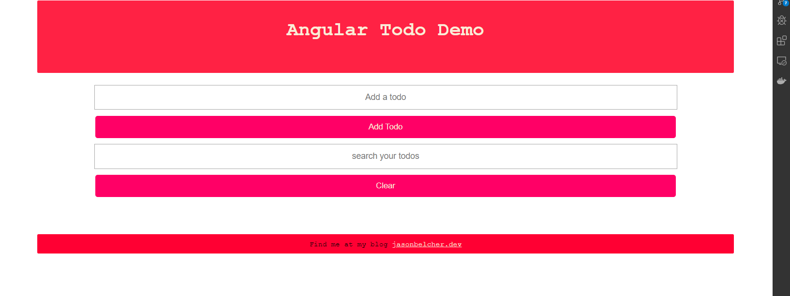

# AngularTodos

## Description

Todo app of the garden variety. The app has 2 services.  One being a mock of the backend using just JavaScript and automatically resolved Promises.  The other service is actually hooked up to an api using AJAX. You can find the back end code [here](https://github.com/JasonBBelcher/todos-backend).

You can find an online version on [codesandbox](https://codesandbox.io/s/angular-2c6v2?fontsize=14)

